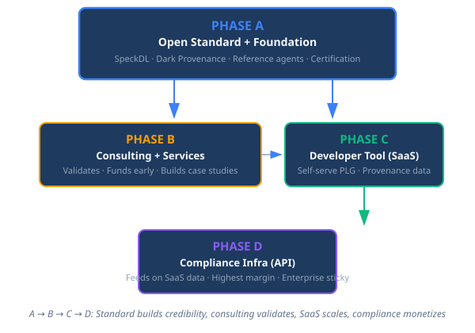

# Speckl Strategy — Phased Open Standard Approach

> *The open standard is the root. Everything else grows from it.*

---

## Core Thesis

Phase A (open standard + foundation) is the **engine**. All revenue flies by on the credibility, adoption, and ecosystem that the open standard builds.

**The flow:** Open standard (A) builds the language and community → hands-on consulting (B) validates the methodology → SaaS (C) scales it to more teams → compliance API (D) serves enterprise needs.

---

## Phase 1 — Establish the Standard (A + B)

**Goal:** SpeckDL is real, public, and proven in at least one real system.

### Phase A Actions

- **Open-source SpeckDL** under Apache 2.0 or MIT
  - Publish the language spec, a minimal reference compiler, and Z3 verification example
  - README: "The spec-first language for auditable software"
- **Publish the Dark Provenance whitepaper**
  - Target: arxiv, dev blogs, standards-body working groups
  - Positioning: formal methods for the AI age
- **Create a Speckl playground** — browser-based spec editor with compiled output + provenance graph
- **Register domains**, set up minimal site

### Phase B Actions

- **Sign consulting engagements** with regulated-industry companies
  - Deliverable: a functioning Speckl system + trained team + full compliance traceability
- **Validate:**
  - Is SpeckDL expressive enough for real specs?
  - Does the tiered agent harness reduce spec-to-ship time?
  - What do compliance auditors actually need?

---

## Phase 2 — Build the SaaS (C, fed by A + B)

**Goal:** Self-serve Speckl dev tool with paying users.

### Phase C Launch

- **Speckl SaaS** — hosted platform where teams write Specks, the agent harness verifies them, and the platform maintains the provenance graph
- **Features:**
  - Speck editor with live Z3 verification
  - Agent harness: Orchestrator → Team Lead → SME tier auto-scaling
  - TillDone condition tracking
  - Provenance graph browser

### How A feeds C

- Open-source SpeckDL means new users arrive already familiar with the DSL
- Community contributors find bugs, suggest features, write integrations
- The playground converts browsers → SaaS signups
- Certification program creates a pipeline of "Speckl Certified" engineers

### How B feeds C

- Consulting case studies validate the product for prospects
- Consulting engagements expose real-world requirements that shape the roadmap
- Consulting clients become reference accounts and early SaaS customers

---

## Phase 3 — The Compliance API (D, fed by C)

**Goal:** Enterprise compliance product with real provenance graph data.

### Phase D Launch

- **Speckl Compliance API** — a standalone API that plugs into existing CI/CD
  - Ingest: spec documents, requirements, code
  - Output: compliance evidence bundles, traceability matrices, audit-ready reports
  - Compliance packs for regulated domains (DO-178C, IEC 62304, SOC 2, ISO 26262)

### How C feeds D

- SaaS users generate real provenance graph data at scale
- SaaS feature requests reveal what compliance officers need
- SaaS revenue funds D development during long enterprise sales cycles

### How A continues feeding

- The open standard is the market's trust signal
- Standards bodies adopt Dark Provenance methodology
- Speckl certification becomes a credential, and D product becomes the tool certified teams use

---

## Ownership & Governance

**Speckl operates as a brand/property within Greybeard Holdings, LLC.** Not a separate entity.

- SpeckDL is open-source (MIT/Apache 2.0)
- Dark Provenance methodology is published freely
- Trademark "Speckl" and certification authority held by Greybeard Holdings
- Commercial products are Greybeard Holdings revenue lines under the Speckl brand

---

## Metrics

| Phase | North Star Metric |
|-------|------------------|
| **1 (A+B)** | Specks written on the open standard |
| **2 (C)** | Provenance graphs created (SaaS) |
| **3 (D)** | Compliance reports exported |

---

*For the full strategy document including budgets and revenue projections, see the private speckl-marketing repository.*